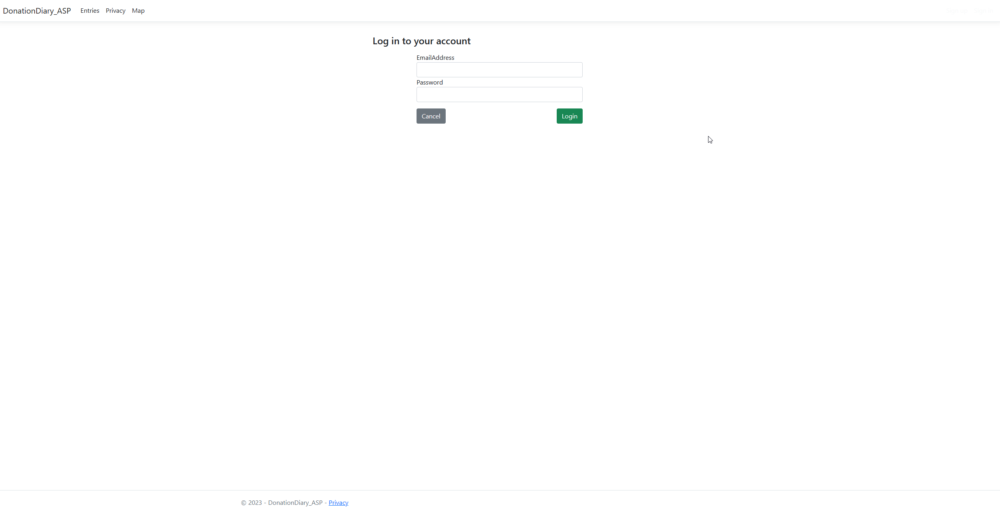
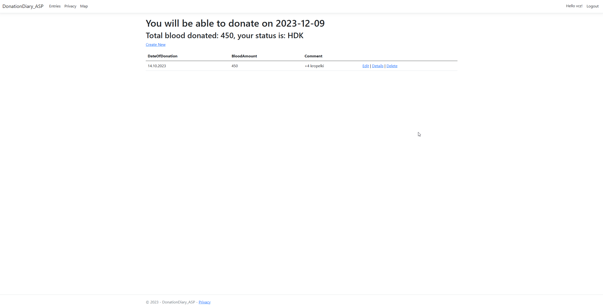

# DonationDiary

<!-- TOC -->
- [DonationDiary](#donationdiary)
  - [Introduction](#introduction)
  - [Screenshots](#screenshots)
  - [Technologies](#technologies)
  - [Running DonationDiary](#running-donationdiary)
  - [Use cases](#use-cases)
  - [Project status](#project-status)
<!-- TOC -->

## Introduction
DonationDiary is a platform for blood Donors located in Poland. It allows you to store your dates of donations and display:
- user entries
- total amount donated
- next date of donation
- user status (awarded medals)
- donation centers

## Screenshots

Login page

Entries page

Map page

## Technologies

DonationDiary tech stack:

- ASP .Net
- JavaScript
- HTML
- CSS
- PostGreSQL / SQL Express

## Running DonationDiary
To launch the DonationDiary application

1. Clone this repository to your local computer.
2. Copy the database file and import it with Docker.
3. Install all the required dependencies
4. Launch the application.

## Use cases
Here are some use cases of this application:

1. Adding Donors to the database.
2. Viewing user entries and displaying user's status.
3. Finding donation centers nearby
4. Planning your next donation

## Project status
This project is currently in the development phase. New functionalities are being added and improvements are being made during the development.